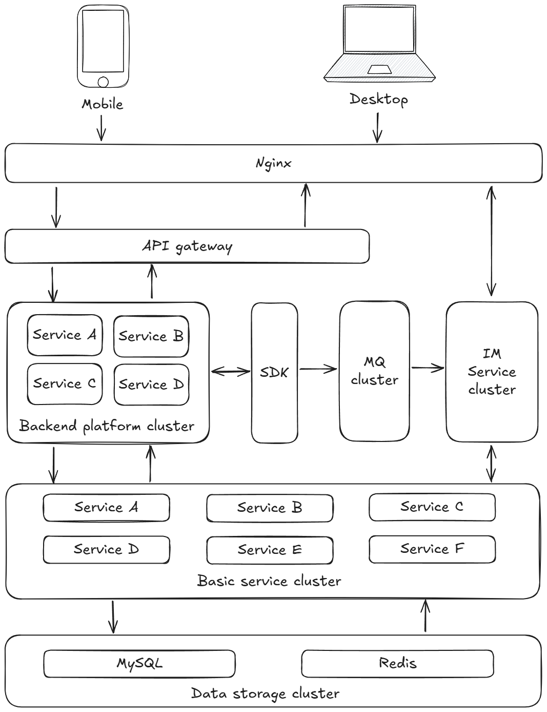

# Bonjour

---

English | [中文](README_cn.md "查看中文版")

Bonjour is a distributed instant messaging system based on **JDK 21**, **Spring Boot 3**, and **Spring Cloud**, designed
with a front-end/back-end separation architecture.

## Features

- Layered architecture inspired by Domain-Driven Design (DDD)
- Front-end and back-end are deployed independently, offering strong flexibility
- Backend interfaces follow a RESTful-like design style
- The system adopts a microservices architecture, with all internal services exposed externally through a unified API
  gateway

## System Architecture

## Built-in Functions

1. **User Management**: User registration, login, profile updates, etc.
2. **Friend Management**: Add, delete, view, remark friends, etc.
3. **Group Management**: Create, join, view, remark, leave, and dissolve groups, etc.
4. **Message Management**: Send, receive, recall, and delete private and group messages
5. **Multi-type Message Support**: Text, emoji, images, files, voice, video, and video calls
6. **Online Users**: Monitor the activity status of online users
7. **Message Notifications**: New message alerts, read/unread tracking
8. **Message History**: Storage and query of historical messages

## Online Demo

- lena-test / lena-test
- lenatest1 / lenatest1
- lenatest2 / lenatest2
- lenatest3 / lenatest3

[Demo Address](http://117.72.85.211:8898/ "Click to visit the online demo")

## Frontend

- [Bonjour-front](https://github.com/JunjianD/Bonjour-front "Access the Bonjour frontend repository")

## Open Source License

- Bonjour is released under the [Apache License 2.0](LICENSE "View License").  
  You are free to use, modify, and distribute the project’s code under the terms of this license.
