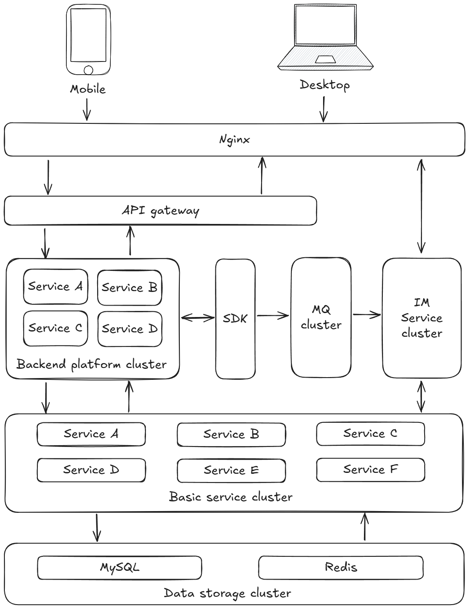

# Bonjour

---

[English](README.md "View English version") | 中文

Bonjour是一个基于JDK21，SpringBoot3，SpringCloud设计的前后端分离的分布式即时通讯系统

## 特点

- 参考领域驱动设计（DDD）思想进行分层架构
- 前后端分离，前后端应用独立部署，灵活性强
- 后端采用类 RESTful 风格设计接口
- 系统采用微服务架构，所有内部服务通过统一的 API 网关对外暴露

## 系统架构

## 内置功能

1. **用户管理**：用户注册、登录、资料修改等
2. **好友管理**：添加、删除、查看、备注好友等
3. **群组管理**：创建、加入、查看、备注、退出、解散群组等
4. **消息管理**：私聊与群聊消息的发送、接收、撤回、删除等
5. **多类型消息支持**：文本、表情、图片、文件、语音、视频、视频通话等
6. **在线用户**：当前系统活跃用户状态监控
7. **消息通知**：新消息通知、消息已读未读监控
8. **历史消息**：历史消息的存储与查询

## 在线演示

- lena-test/lena-test
- lenatest1/lenatest1
- lenatest2/lenatest2
- lenatest3/lenatest3

[演示地址](http://117.72.85.211:8898/ "点击访问在线演示")

## 前端

- [Bonjour-front](https://github.com/JunjianD/Bonjour-front "访问Bonjour前端代码仓库")

## 开源许可

- Bonjour基于[Apache License 2.0](LICENSE "查看许可证")开源协议发布，您可以在遵守该协议的前提下自由使用、修改和分发本项目的代码。
